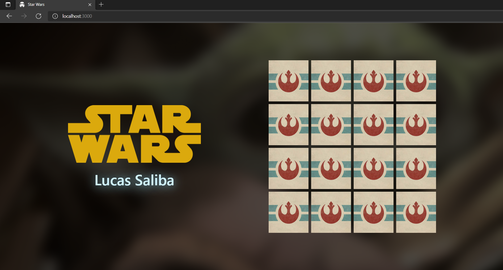
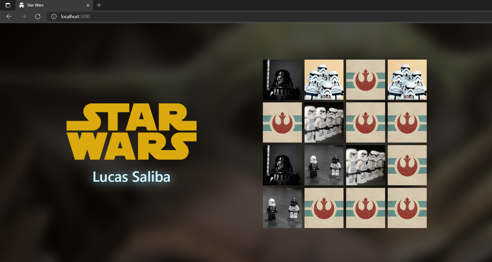
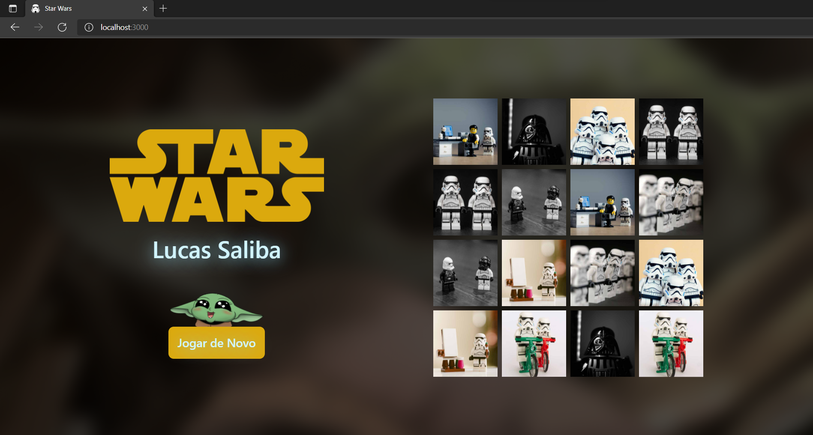

# Star-Wars-Memory-Game

Um jogo da memória com tematica do Star Wars. O objetivo era elaborar o projeto utilizando TypeScript focando na tipagem de dados. Foi utilizado React e styled-components para montagem da aplicação. Os dados dos cards estão armazenados localmente, sendo submetidos a uma ordencão aleatória a cada nova partida. 

  

  

  

